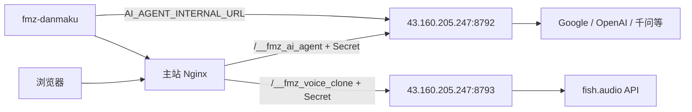

# AI 网关分离部署（主站 ↔ 43.160.205.247）

主站 **118.195.150.4**（www.dianfanbao.net）继续提供静态、弹幕、**音频提取**（`/__fmz_audio` → 本机 8789）等业务。

**43.160.205.247** 仅部署：

- **AI Chat**（`ai-agent-server` :8792，Gemini / OpenAI / 千问等）
- **Fish Audio 语音合成**（`voice-clone-server` :8793，`/__fmz_voice_clone` → [fish.audio](https://fish.audio) API）

主站经 **HTTP + 共享密钥** 访问网关机（推荐，与现有 `/chat` SSE 一致）。

**浏览器路径（生产）：**

1. 用户打开 `https://www.dianfanbao.net` → 前端请求 `GET/POST /__fmz_ai_agent/...`
2. 主站 **Nginx** 注入 `X-FMZ-Remote-Secret`，反代到 **43.160.205.247:8792**
3. 网关机 **ai-agent-server** 拉取模型列表、转发 Chat 到 Google / 千问等
4. 响应经 Nginx 原路返回页面（主站 **不** 再跑本地 `fmz-ai-agent`）

打包需 **`package.json` → `fmzFeatures.aiAgent: true`**，否则顶栏无「AI 分析」面板。

配置源：**[`deploy/servers.json`](servers.json)**。

## 架构



## 一次性准备

### 1. 网关机 43.160.205.247

```bash
# 密钥与 API（勿提交 Git）
sudo cp deploy/fmz-ai-gateway.env.example /etc/fmz-ai-gateway.env
sudo chmod 600 /etc/fmz-ai-gateway.env
# 填写：FMZ_REMOTE_SERVICE_SECRET、GEMINI_API_KEY、FMZ_AI_AGENT_LOCAL_PROXY 等

# 云安全组（必做，否则主站 Nginx 会 504）：在 43.160.205.247 的入站规则放行
#   来源 118.195.150.4/32，TCP 8792、8793
# 自检：在主站执行 curl --connect-timeout 3 http://43.160.205.247:8792/ 应能连通（非 000）
# FISH_AUDIO_API_KEY 写在网关机 /etc/fmz-ai-gateway.env（勿放主站）
```

本机：

```powershell
# 部署 AI 后端到网关机
$env:FMZ_DEPLOY_TARGET = "tencent-43"
npm run pack -- --yes
node scripts/deploy.mjs --target=tencent-43
```

### 2. 主站 118.195.150.4

在 **`deploy/deploy.local.env`** 增加（与网关机相同随机串）：

```env
FMZ_REMOTE_SERVICE_SECRET=你的长随机串
FMZ_DEPLOY_SYNC_NGINX=1
```

```powershell
npm run pack -- --yes
node scripts/deploy.mjs --target=dianfanbao
```

脚本会：

- 停用主站本地 `fmz-ai-agent` / `fmz-voice-clone`
- 上传 Nginx `fmz-remote-upstreams.conf` → 43.160.205.247
- 合并 `AI_AGENT_INTERNAL_URL=http://43.160.205.247:8792` 到弹幕 `danmaku.env`

### 3. 验证

```bash
# 网关机
curl -s -H "X-FMZ-Remote-Secret: $SECRET" http://127.0.0.1:8792/models | head

# 主站（经 Nginx）
curl -sk https://www.dianfanbao.net/__fmz_ai_agent/models -H "Cookie: ..." | head
```

## 环境变量速查

| 位置 | 变量 |
|------|------|
| 网关机 `/etc/fmz-ai-gateway.env` | `FMZ_REMOTE_SERVICE_SECRET`、`GEMINI_API_KEY`、`FMZ_AI_AGENT_LOCAL_PROXY` |
| 主站 `/opt/fmz-danmaku-server/danmaku.env` | `AI_AGENT_INTERNAL_URL`、`FMZ_REMOTE_SERVICE_SECRET` |
| 主站 Nginx `fmz-remote-secret.inc` | 与上相同的 Secret（deploy 生成） |

## 说明

- **音频提取**（忽闻宝声 / `audio-extractor-server`）**不**迁到网关机，始终在主站 `127.0.0.1:8789`。
- **Fish Audio TTS** 由网关机 `fmz-voice-clone` 出站调用；主站 Nginx 只反代到 43.160.205.247:8793。
- 开发机本地仍为 `127.0.0.1:8792` / `8793`，不受分离配置影响。
